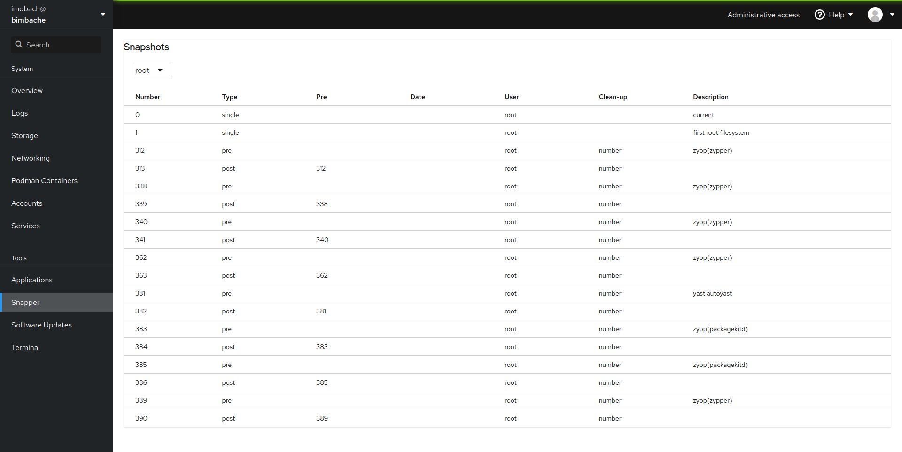

# Cockpit Snapper

This module implements a [Cockpit](https://cockpit-project.org/) user interface
for [Snapper](http://snapper.io). The development started as a proof-of-concept
and a lot of work remains to be done. At this point, it is only able to display
the list of snapshots for a given configuration.

This module is based on the [Cockpit Starter
Kit](https://github.com/cockpit-project/starter-kit).
